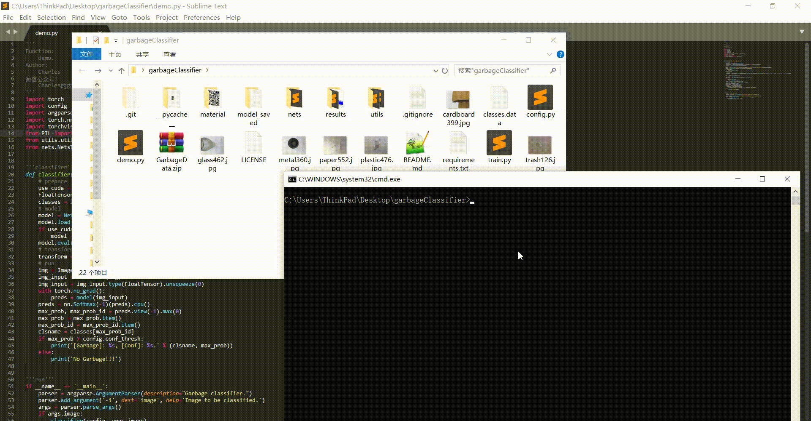

# garbageClassifier
```sh
garbage classifier, open an issues please if you have any problems.
You can star this repository to keep track of the project if it's helpful for you, thank you for your support.
```

# Introduction
#### in Chinese
https://mp.weixin.qq.com/s/n6eKeuhmg6YFgQLVvm3LDg

# Environment
```
OS: Ubuntu16.04(train)/Windows10(test)
Graphics card: Tian XP(train)/1050Ti(test)
Python: Python3.5+(have installed the neccessary dependencies)
```

# Usage
#### Train
```
Unzip the dataset which is from https://www.kaggle.com/asdasdasasdas/garbage-classification/version/2.
for example:
run "unzip GarbageData.zip"
Then, run:
python train.py
```
#### Test
```
usage: demo.py [-h] [-i IMAGE]

Garbage classifier.

optional arguments:
  -h, --help  show this help message and exit
  -i IMAGE    Image to be classified.
```

# Results
#### train

#### test


# More
#### WeChat Official Accounts
*Charles_pikachu*  
